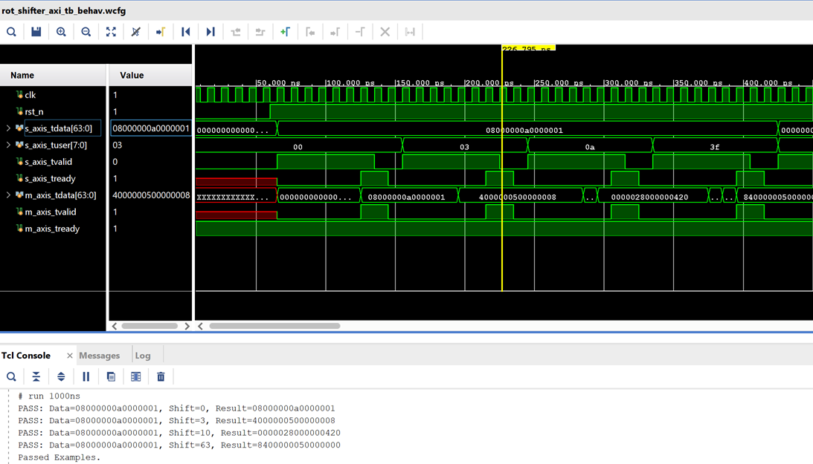
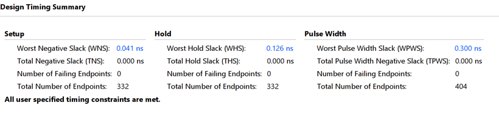

# Seth Miers Infleqtion Interview Solution

The original interview problem can be found in [docs](./docs/ProblemStatement.md)

## Overview

In many designs a barrel shifter likely isn't the source of timing issues, and for readability and maintenance of the overal system it might be better just to use a simple shift opperation:

```vhdl
data_out <= data_in(63 - s downto 0) & data_in(63 downto 64 - s);
```

This is elegant and simple, but when trying to save picoseconds or optimise for **f_max** it becomes more difficult to control. An FPGA typically does not have a 64:1 mux, but most FPGAs have 6:1 LUTs, that the synthesizer will use to create this 64:1 mux. The problem here is we've lost the ability to pipeline all of these LUTs that are used to create this mux.

The design in this project implements a module that adds a pipelining register for every LUT (never exceeding logic level 1). The design also includes generics to enable and disable pipeliens as needed so we can balance between frequency and execution time.

The design also assumes it will be used in a bigger system and was synthesized as an out-of-context module. An experienced FPGA engineer that knows how to interface with this module and make sure all inputs are all synchronous and constrained propelry.

**The Design achieves a 625MHz clock for this barrel shifter and completes the operation in 6 clock cycles using an AXI-4 stream protocol**

The design has been verified to be correct with the test bench. Details on how to run the entire project, including simulation, are provided.

## Design Decisions

### Part Selection

As I don't have a production environment at home, I have to work with free tools available to me at home that can be run on my Microsoft Surface Pro.

With that in mind, a great selection is Spartan 7 xc7s15cpga196, as it's free and it lacks the complexities that would increase synthesis and testing for this module. I did however use the -2 speed grade to optimize for f_max over lower speed grades.

For profession/produciton environments, better options could be employed and the following might be considered:

- A smaller etching process (7nm for example) would have smaller routing delays.
- Devices with better speed grades
- FPGAs with specific routing structures (dedicated carry chains).

### Logic Level 1 Restriciton

I was brainstorming creative solutions such as using different blocks in the FPGA or manipulating BRAM, but since **f_max** needed to be optimized for with full piplining to maintain logic level 1, these solutions weren't viable:

- A DSP slice cannot be used, even without its pipeline registers. It would be pretty costly to do so anyway.
- BRAM cannot be used, as a 64 bit decoder would require at least 6 gate levels
- LUTs could be used and pipelined
- Optimizing for *f_max* would mean then reduce to proper routing and piplining
- Overal computation time would come from the number of LUT levels

**f_max Estimation:**
If we assume 0.5ns for a LUT opperation and 1ns for routing, we might be able to get our design to a 650MHz. Achievable results might vary.

With 64 input bits and 8 shift-select bits (Note: The top 2 bits can be ignored, as 8'b01000000 is just 1 full roation, 8'b10000000 is 2 full rotations, and 8'b11000000 is 3 full rotations), that results in 64+6=70 inputs per output bit.

A single LUT unit in a Spartan 7 is a 6-input LUT. Therefore (Log_6(70)=2.3) 3 total pipelined leves would be needed.

Essentially what we want is a 64:1 mux, but we can only do this using 6-input LUTs which can easily create 4:1 Muxs. With 3 stages of 4:1 muxes we can create a 64:1 mux. 3 stages would need to be done in order to properly pipeline everytihng so that only one logic level is used per stage. 

However, it should be noted that each stage in my design has high fanout which increases propogation delay.

### Further/Future Improvements

#### Propogation Delay

- Adding several stages of registers will significantly increase total computation time, but we could reduce fanout
- Manually placing registers and LUTs in cells that are the same or very close to each other for very critical paths (BEL constraints)
- Constraining paths and custom floor planning
- Use synthesis friendly HDL with attributes
- Other optimization directives

#### Logic Delay

There isn't a whole lot we can do about logic delay, in some cases a smaller etching process (7nm). We could also use specific hardware that has dedicated blocks that might help us. The only other thing is using higher speed grade FPGAs. But in general, logic delay is fixed.

## Project Creation and Simulation

The project has been exported to a TCL file, It can be created in this directory.

**Note:** I will assume the GUI version of vivado for this section.

Launch vivado and in the TCL console cd to the ./target directory.
Source the TCL file:
`source ../scripts/Infleqtion_rot_shifter.tcl.tcl`

To then run simulation, just click 'Run behavioral simulation'. The test bench will run and you will see the following:



To implement the out of context module, you can run:
`source ../scripts/f_max_ooc.tcl`

You will then be able to see the timing



This is with the current constrains file that has a 1.6nm clock set (625MHz).